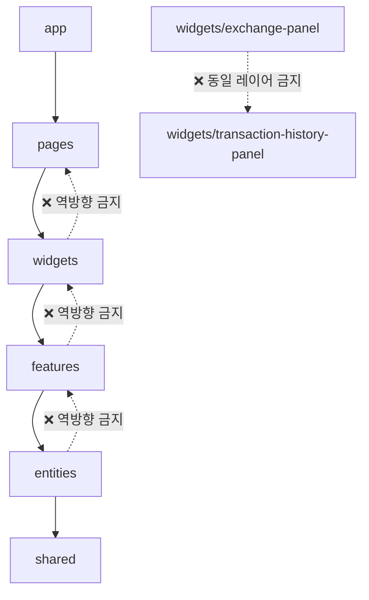
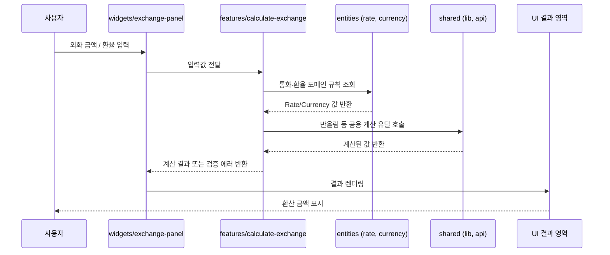
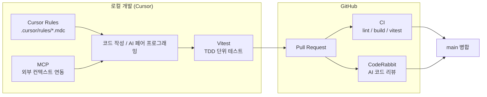
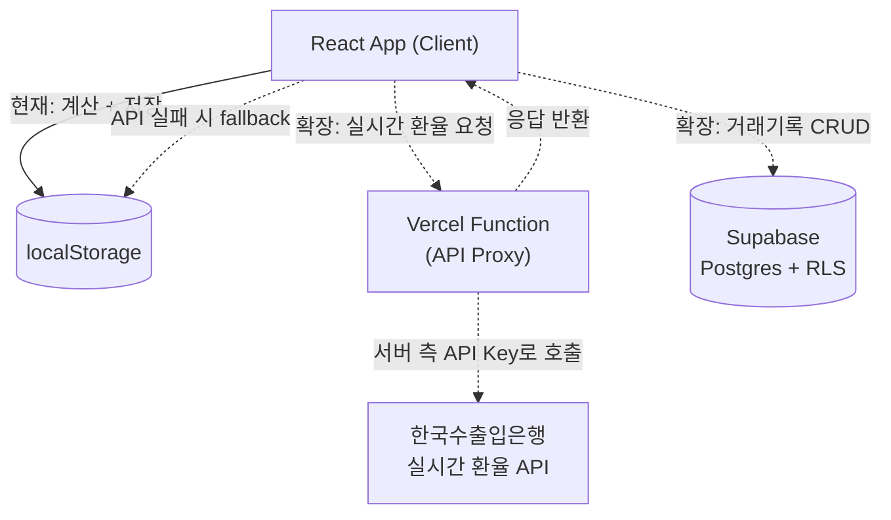

# Architecture

> 외환 창구 업무 도우미 (KB FX Helper)

## 문서 개요

이 문서는 프로젝트의 목표 아키텍처와 설계 의도를 설명한다. 프로젝트는 React + Vite + TypeScript + Tailwind CSS v4 위에 Feature-Sliced Design(FSD)을 적용하며, Cursor Rules로 아키텍처 규칙을 강제한다.

> **구현 상태 표기 기준**
> 이 문서에서 "설계 완료"는 폴더/레이어/의존 규칙이 확정되었음을 의미하며, "구현 완료"를 의미하지 않는다. 현재 대부분의 슬라이스는 `index.ts` public API만 존재하는 스켈레톤 상태이고, `ExchangePanel`, `TransactionHistoryPanel` 등 일부 UI 컴포넌트만 초기 골격이 작성되어 있다. 각 절에서 실제 구현 상태를 별도로 표기한다.

## 목차

1. [왜 FSD를 선택했는가](#1-왜-fsd를-선택했는가)
2. [Layer 설명](#2-layer-설명)
3. [Dependency Rule](#3-dependency-rule)
4. [Slice 설계](#4-slice-설계)
5. [Domain 설계](#5-domain-설계)
6. [Data Flow](#6-data-flow)
7. [AI 협업 전략](#7-ai-협업-전략)
8. [향후 확장성](#8-향후-확장성)

---

## 1. 왜 FSD를 선택했는가

### 1.1 DDD-lite와 비교

| 비교 항목 | FSD (Feature-Sliced Design) | DDD-lite (경량 도메인 주도 설계) |
|---|---|---|
| 구성 기준 | Layer(계층) × Slice(도메인)의 2차원 구조 | Bounded Context 단일 기준 |
| 프론트엔드 적합성 | 프론트엔드 전용으로 설계됨 (`pages`, `widgets` 등 UI 개념 포함) | 원래 백엔드 도메인 모델링에서 유래, 프론트 UI 계층 개념이 없음 |
| 규칙의 명시성 | 폴더 구조 자체가 의존 규칙 (`app → … → shared`) | 컨텍스트 경계를 코드 구조로 강제하기 어려움, 팀 컨벤션에 의존 |
| 도입/학습 비용 | 규칙이 단순하고 툴링(lint, Cursor Rules)으로 강제하기 쉬움 | Bounded Context를 나누기 위한 도메인 분석 비용이 큼 |
| 이번 프로젝트 규모 | 대시보드 1개, 유스케이스 3~4개 수준의 소규모에 적합 | Bounded Context를 나눌 만큼 도메인이 복잡하지 않아 과설계(over-engineering) 위험 |

### 1.2 이번 프로젝트에 적합한 이유

- **화면과 유스케이스가 단순하다**: 대시보드 페이지 1개 안에서 "환전 계산"과 "거래기록 조회"라는 2개의 유스케이스만 존재한다. DDD의 Bounded Context 분리는 이 규모에서 과설계가 된다.
- **AI(Cursor) 협업 전제**: FSD는 레이어별 폴더 경로가 곧 규칙이므로, `.cursor/rules/*.mdc`의 `globs`로 레이어/슬라이스 단위 규칙을 정확히 걸 수 있다. DDD-lite는 규칙을 코드 구조가 아닌 문서로만 강제해야 해서 AI 코드 생성 시 일관성이 떨어진다.
- **단방향 의존 규칙**: `app → pages → widgets → features → entities → shared`라는 단순한 선형 규칙은 리뷰어(사람 또는 CodeRabbit)가 위반 여부를 즉시 판단할 수 있다.
- **점진적 확장과 궁합이 좋다**: 8장에서 다루는 Supabase/Vercel/실시간 환율 확장은 `entities`, `shared/api` 레이어만 교체하면 되므로, 레이어 경계가 확장 지점을 자연스럽게 정의해준다.

---

## 2. Layer 설명

| Layer | 역할 | 이 프로젝트에서의 예 | 의존 가능 대상 |
|---|---|---|---|
| `app` | 앱 진입점, 전역 설정/Provider 초기화 | `src/app/App.tsx`, `src/main.tsx` | pages, widgets, features, entities, shared |
| `pages` | 라우트(화면) 단위로 위젯을 조합 | `src/pages/dashboard` | widgets, features, entities, shared |
| `widgets` | 여러 feature/entity를 묶은 독립적인 UI 블록 | `src/widgets/exchange-panel`, `src/widgets/transaction-history-panel` | features, entities, shared |
| `features` | 사용자 행동(유스케이스) 단위의 로직 + UI | `src/features/calculate-exchange`, `add-transaction`, `search-transaction` | entities, shared |
| `entities` | 도메인 모델과 그에 대한 순수 로직 | `src/entities/currency`, `src/entities/rate`, `src/entities/transaction` | shared |
| `shared` | 특정 도메인에 속하지 않는 재사용 자원 | `src/shared/ui`, `lib`, `api`, `config` | (없음, 최하위 레이어) |

---

## 3. Dependency Rule

### 3.1 Layer Dependency Diagram

### 3.2 규칙 요약

- **역방향 import 금지**: 하위 레이어는 상위 레이어를 알 수 없다. 예) `entities`는 `features`, `widgets`, `pages`, `app`을 import할 수 없다.
- **동일 레이어 import 금지**: 같은 레이어의 다른 슬라이스를 직접 참조하지 않는다. 공유가 필요하면 더 아래 레이어(`entities`, `shared`)로 내린다.
- **Public API만 사용**: 모든 슬라이스는 `index.ts`를 통해서만 외부에 노출되며, 내부 파일을 직접 import하지 않는다.

이 규칙은 `.cursor/rules/00-architecture.mdc`에 정의되어 Cursor가 코드 생성 시 자동으로 강제한다.

### 3.3 Dependency Rule 예시

| 케이스 | 예시 | 허용 여부 | 이유 |
|---|---|---|---|
| 상위 → 하위 | `widgets/exchange-panel`가 `features/calculate-exchange`를 import | ✅ 허용 | 정상적인 의존 방향 |
| 하위 → 상위 (역방향) | `entities/rate`가 `features/calculate-exchange`를 import | ❌ 금지 | 순환 참조와 레이어 간 강결합 유발 |
| 동일 레이어 간 | `widgets/exchange-panel`가 `widgets/transaction-history-panel`을 import | ❌ 금지 | 슬라이스 간 직접 결합 방지 |
| 내부 파일 직접 참조 | `features/calculate-exchange/model/calculate.ts`를 직접 import | ❌ 금지 | 캡슐화 위반, `index.ts` public API 우회 |
| Public API 경유 | `features/calculate-exchange` (즉 `index.ts`)를 import | ✅ 허용 | 슬라이스 내부 구현이 자유롭게 바뀌어도 외부 계약은 유지 |

---

## 4. Slice 설계

각 슬라이스는 `index.ts`를 public API로 노출하며, 내부 구현(컴포넌트, 로직, 타입)은 슬라이스 폴더 안에서 자유롭게 구성한다.

**widgets**

- `exchange-panel`: 환전 계산 UI를 감싸는 위젯. `features/calculate-exchange`(계산 로직)와 `entities/currency`, `entities/rate`(통화/환율 표시)를 조합해 하나의 화면 블록으로 제공한다.
- `transaction-history-panel`: 거래기록 목록 UI를 감싸는 위젯. `entities/transaction`(거래 데이터)과 `features/search-transaction`(검색/필터, 선택 기능)을 조합한다.

**features**

- `calculate-exchange`: "외화 금액과 환율을 입력해 원화 환산 금액을 계산한다"는 핵심 유스케이스. 입력 검증, 계산 실행, 에러 메시지 생성을 담당한다.
- `add-transaction`: "계산 결과를 거래기록으로 저장한다"는 유스케이스. `entities/transaction` 모델을 생성하고 영속화(현재는 localStorage)를 트리거한다.
- `search-transaction`: "저장된 거래기록을 조건으로 조회한다"는 유스케이스(PRD 선택 기능). 기간/환종 등 조건으로 `entities/transaction` 목록을 필터링한다.

**entities**

- `currency`: 통화(USD, JPY 등) 도메인 모델과 통화별 표시 규칙(예: JPY 100단위 고시)을 정의한다.
- `rate`: 환율 도메인 모델과 환율 관련 순수 계산 규칙(반올림 순서 등)을 정의한다.
- `transaction`: 거래기록 도메인 모델(환종, 금액, 환율, 환산 금액, 처리 시각)을 정의한다. 개인정보는 포함하지 않는다.

**shared**

- `ui`: 도메인과 무관한 공용 UI 컴포넌트(버튼, 입력창, 카드 등).
- `lib`: 도메인과 무관한 순수 유틸리티(숫자 포맷, 반올림, 날짜 처리 등).
- `api`: localStorage 접근, 외부 API 호출 등 영속성/네트워크 어댑터.
- `config`: 환경변수, 상수 등 앱 전역 설정.

> **구현 상태**: 위 슬라이스는 모두 폴더와 `index.ts`(public API)가 생성되어 있으나, `exchange-panel`, `transaction-history-panel`을 제외한 대부분은 아직 내부 로직이 구현되지 않은 스켈레톤 상태다.

---

## 5. Domain 설계

| 도메인 관심사 | 담당 Layer/Slice | 책임 | 구현 상태 |
|---|---|---|---|
| 환율 계산 | `features/calculate-exchange` + `entities/rate`, `currency` | 입력 검증 → 적용환율 반올림 → 금액 계산 → 원화 정수 반올림 순서로 처리하는 순수 함수. JPY는 100단위 고시가를 1단위로 환산 | 설계 완료, 구현 예정 |
| 거래기록 | `entities/transaction` + `features/add-transaction`, `search-transaction` | 거래 도메인 모델 정의, 등록/조회 유스케이스. 개인정보 미포함 | 설계 완료, 구현 예정 |
| 송금 계산 | `features/calculate-exchange` 확장 또는 신규 feature (예: `calculate-remittance`) | 환율 계산에 수수료 규칙을 추가한 확장 계산 (PRD 선택 기능) | 미착수 |
| localStorage | `shared/api` | 거래기록 저장/조회 어댑터. 저장 실패 시 사용자 안내, 계산 기능은 계속 동작 | 설계 완료, 구현 예정 |
| 외부 API | `shared/api` | 실시간 환율 조회 어댑터(한국수출입은행). 실패 시 마지막 localStorage 값으로 fallback (PRD 선택 기능) | 미착수 |

**핵심 원칙**

- 계산 로직(`entities`, `features`)은 항상 순수 함수로 작성하고, API 호출·상태 변경·DOM 접근을 포함하지 않는다.
- 영속성(localStorage)과 외부 연동(API)은 `shared/api`에 격리하여, 계산 도메인이 저장/네트워크 방식 변경에 영향받지 않도록 한다.
- UI(`widgets`, `pages`)는 계산식을 직접 갖지 않고, `features`가 노출하는 함수/훅을 호출만 한다.

---

## 6. Data Flow

입력값이 유효하지 않은 경우(음수, 빈 값, 숫자가 아닌 값) `features/calculate-exchange`는 계산을 수행하지 않고 에러 메시지를 반환하며, 이 흐름은 위 시퀀스에서 `Fe-->>W` 단계의 결과가 "에러"로 대체되는 것으로 표현된다.

---

## 7. AI 협업 전략

| 도구 | 사용 시점 |
|---|---|
| Cursor Rules | 코드 생성 시점. 레이어 의존 방향(`00-architecture`), 계산 도메인 규칙(`10-domain-fx`), UI 컨벤션(`20-ui`), 테스트 컨벤션(`30-testing`), 보안(`40-security`), API/클라우드 연동(`50-api-cloud`)을 자동으로 강제 |
| Vitest | 도메인/계산 로직 작성 전후. 실패하는 테스트를 먼저 작성(TDD)하고, 경계값(반올림, 0, 음수 등) 테스트로 회귀를 방지 |
| GitHub | 커밋 이후. Pull Request로 변경을 리뷰하고, GitHub Actions(CI)로 lint/build/vitest를 자동 실행 |
| CodeRabbit | Pull Request 생성 시점. FSD 레이어 위반, public API 우회, 도메인 규칙 위반 등을 AI가 1차로 리뷰 |
| MCP | 개발 중 필요 시. 외부 문서/서비스(예: 향후 Supabase 스키마, API 명세 등)에 대한 컨텍스트를 Cursor에 연결해 정확도를 높임 |

이 흐름의 목적은 "규칙은 사람이 아니라 도구가 지키게 한다"는 것이다. Cursor Rules가 생성 단계에서, Vitest가 로컬 검증 단계에서, CodeRabbit과 CI가 PR 단계에서 각각 다른 종류의 실수를 걸러낸다.

---

## 8. 향후 확장성

| 확장 항목 | 현재 상태 | 연결 방법 | 영향받는 Layer/Slice |
|---|---|---|---|
| Supabase | **구현 완료** (localStorage와 병행) | `shared/api/supabase.ts`가 client 생성만 담당하고, 실제 인증(`auth.signInAnonymously`)·테이블 접근(`from('transactions')`)은 `features/add-transaction`에서만 수행. localStorage가 항상 동기적 source of truth이고 Supabase는 best-effort 미러링(추가/삭제 실패는 pending add/tombstone으로 기록해 재시도) | `shared/api`, `shared/config`, `features/add-transaction` |
| Vercel | 미착수 | 프론트는 직접 외부 API를 호출하지 않고, `/api` 경로의 Vercel Function이 프록시. API Key는 서버(Function) 환경변수에만 존재 | `shared/api`, 배포 설정(`vercel.json`) |
| 실시간 환율 | 미착수 (현재 고정/입력값 기반) | 한국수출입은행 API를 Vercel Function 경유로 조회 → `entities/rate` 갱신. 실패 시 `shared/api`가 마지막 localStorage 값으로 fallback하고 "최신 환율이 아닐 수 있음"을 안내 | `entities/rate`, `shared/api` |

Supabase 연동은 `entities`와 `shared/api`의 인터페이스만 유지하면 되도록 설계했기 때문에, `widgets`/`pages` 레이어의 코드는 변경하지 않고 확장했다(`widgets/transaction-history-panel`은 여전히 `features/add-transaction`의 public API만 사용). 이는 3장의 Dependency Rule과 5장의 Domain 설계에서 계산/저장/네트워크 책임을 분리해 둔 결과다.

### 8.1 Supabase 연동 상세 (구현 완료)

**인증**: 로그인 UI 없이 Supabase Auth의 익명 로그인(`signInAnonymously`)만 사용한다. `features/add-transaction/lib/supabaseAuth.ts`가 세션을 캐시하고, 발급된 `user_id`로 자신의 행만 RLS를 통과한다.

**테이블**: `transactions(id text pk, created_at, currency_code, transaction_type, amount, base_rate, spread_rate, preferential_rate, applied_rate, krw_amount, user_id uuid → auth.users(id))`. 정의는 `docs/supabase-schema.sql` 참고. `(user_id, created_at desc)` 복합 인덱스로 목록 조회를 커버하고, `authenticated` 역할 + `auth.uid() = user_id` 조건의 select/insert/delete 정책만 존재한다(공개 `anon` 정책 없음).

**동기화 모델**: localStorage 저장/삭제는 항상 동기적으로 즉시 반영되어 UI가 네트워크를 기다리지 않는다. Supabase 반영은 별도로 시도되며, 실패하면 `features/add-transaction/lib/pendingSyncStore.ts`가 추가 실패(pending add)·삭제 실패(tombstone)를 localStorage에 기록해 다음 동기화(`syncNow`)에서 재시도한다. 원격 목록을 병합할 때는 tombstone id를 제외해, 삭제했지만 원격 반영에 실패한 항목이 되살아나지 않도록 한다. `useTransactionHistory`가 마운트 시 1회, 수동 재동기화 버튼, `online` 이벤트 복귀 시 각각 동기화를 트리거한다.

**상태 노출**: `useTransactionHistory`가 `isSupabaseEnabled`/`isSyncing`/`syncMessage`/`syncError`를 노출하고, `TransactionHistoryPanel`이 이를 "로컬 저장"/"클라우드 동기화 중"/"클라우드 동기화 완료"/"클라우드 동기화 실패 — 로컬에는 저장됨"으로 표시한다.
