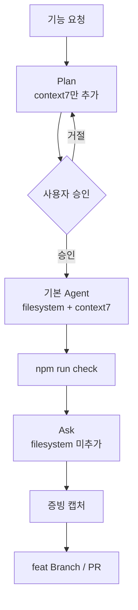

# 작업 방식 가이드 (Plan · Agent · Ask)

> 외환 창구 업무 도우미 (KB FX Helper)

## 문서 개요

이 문서는 Cursor **내장 작업 방식** 3종(계획·구현·리뷰)의 선택 절차, MCP 사용 정책, 단계별 시작 프롬프트 전문, 최종 보고서 증빙 목록을 정의한다.

> **현재 Cursor UI:** Agent 입력창 추가 메뉴에 **Plan**, **Debug**, **Multitask**, **Ask**, **Skills**, **MCP Servers**가 표시된다. 별도의 **Add Custom Mode** 메뉴는 없다. 계획·구현·리뷰 역할 분리는 **Plan / 기본 Agent / Ask** 조합으로 수행한다.

## 목차

1. [작업 방식 개요](#1-작업-방식-개요)
2. [단계별 선택 절차](#2-단계별-선택-절차)
3. [단계별 정의](#3-단계별-정의)
4. [MCP 사용 정책](#4-mcp-사용-정책)
5. [단계별 시작 프롬프트](#5-단계별-시작-프롬프트)
6. [권장 워크플로](#6-권장-워크플로)
7. [증빙 캡처 목록](#7-증빙-캡처-목록)

---

## 1. 작업 방식 개요

현재 설치 버전에서는 별도 Custom Mode UI 없이, Agent 입력창에서 **내장 작업 방식**을 선택해 단계별 역할을 분리한다.

| 단계 | Cursor 작업 방식 | 역할 |
|---|---|---|
| 계획 | **Plan** | FSD 영향 분석, 변경 범위·검증 순서 문서화 (코드 변경 금지) |
| 구현 | **기본 Agent** (Plan 칩 제거) | 승인된 계획만 순서대로 구현 |
| 리뷰 | **Ask** | FSD·보안·테스트 관점 검토, 이슈 목록 작성 (코드 변경 금지) |

- 프로젝트 규칙은 [`.cursor/rules/`](../.cursor/rules/)의 `.mdc` 파일이 담당하고, 작업 방식 선택은 **단계별 행동 제약**을 담당한다.
- **Debug**와 **Multitask**는 디버깅·병렬 작업 등 별도 목적의 기능이며, 이번 3단계 Workflow에는 포함하지 않는다.

---

## 2. 단계별 선택 절차

### 2.1 MCP 서버 사전 설정

1. Cursor **Settings → Tools & MCP**에서 `filesystem`, `context7` 서버를 **Enabled**로 설정한다.
2. [`.cursor/mcp.json`](../.cursor/mcp.json)이 프로젝트 루트에 있는지 확인한다.

> MCP 서버는 프로젝트 수준에서 Enabled하되, **대화별로 MCP Servers 메뉴에서 추가할 서버를 선택**한다.

### 2.2 계획 단계 (Plan)

1. Agent 입력창 추가 메뉴에서 **Plan**을 선택한다.
2. **MCP Servers** 메뉴에서 **context7만** 대화에 추가한다. **filesystem은 추가하지 않는다.**
3. [§5 계획 단계 시작 프롬프트](#계획-단계)를 붙여넣거나, 동일 내용을 첫 메시지로 전달한다.

### 2.3 구현 단계 (기본 Agent)

1. Agent 입력창에서 **Plan 칩을 제거**하여 **기본 Agent** 모드로 전환한다.
2. **MCP Servers** 메뉴에서 **filesystem**과 **context7**을 모두 대화에 추가한다.
3. 승인된 계획을 첨부하고 [§5 구현 단계 시작 프롬프트](#구현-단계)를 참고해 구현을 시작한다.

### 2.4 리뷰 단계 (Ask)

1. Agent 입력창 추가 메뉴에서 **Ask**를 선택한다.
2. **MCP Servers** 메뉴에서 **filesystem은 추가하지 않는다.** API·라이브러리 근거 확인이 필요할 때만 **context7**을 추가한다.
3. [§5 리뷰 단계 시작 프롬프트](#리뷰-단계)를 붙여넣거나, 검토 대상 변경 내용을 첨부한다.

---

## 3. 단계별 정의

| 단계 | Cursor 방식 | 목적 | 파일 변경 | 적용 Rules |
|---|---|---|---|---|
| **계획** | Plan | FSD 영향 분석, 변경 범위·검증 순서 문서화 | **금지** | `00-architecture`, `40-security` + `docs/PRD.md`, `docs/ARCHITECTURE.md` |
| **구현** | 기본 Agent | 승인된 계획만 순서대로 구현 | 승인 범위 내 허용 | 기존 6개 Rules + 계획 문서 첨부 |
| **리뷰** | Ask | FSD·보안·테스트 관점 검토, 이슈 목록 작성 | **금지** | `00-architecture`, `30-testing`, `40-security`, `50-api-cloud` |

---

## 4. MCP 사용 정책

filesystem MCP는 읽기뿐 아니라 `write_file`, `edit_file`, `move_file` 등 **변경 도구**도 제공한다.

| 단계 | Cursor 방식 | filesystem | context7 | 비고 |
|---|---|---|---|---|
| 계획 | Plan | **대화에 추가하지 않음** | **추가** | Cursor 내장 Read file·Codebase search는 허용 |
| 구현 | 기본 Agent | **추가** | **추가** | destructive 도구는 명시적 사용자 승인 후 |
| 리뷰 | Ask | **대화에 추가하지 않음** | 필요 시 **추가** | 검토 결과만 작성 |

> Settings → Tools & MCP에서 두 서버를 Enabled로 유지하되, **계획·리뷰 대화에서는 MCP Servers 메뉴로 filesystem을 선택하지 않는다.**

---

## 5. 단계별 시작 프롬프트

### 계획 단계

```
당신은 외환 창구 업무 도우미(KB FX Helper) 프로젝트의 계획 전담 Agent입니다.

## 역할
- 요구사항과 FSD 아키텍처 영향을 분석하고 구현 계획을 작성합니다.
- 코드·설정 파일을 수정·생성·삭제하지 않습니다.

## MCP 사용
- filesystem MCP를 사용하지 않습니다.
- context7로 라이브러리·API 최신 문서를 조회할 수 있습니다.

## 분석 순서
1. FSD 레이어·슬라이스·public API(`index.ts`) 영향 파악
2. 변경 대상 파일 목록 작성
3. 구현 순서 결정 (entities → shared → features → widgets → pages → app)
4. Vitest 테스트 포인트·경계값 정의
5. 완료 후 `npm run check` 검증 순서 명시

## 산출물
- 변경 파일 목록
- 단계별 구현 순서
- 테스트 계획
- 리스크·미결 질문

## 규칙
- `.cursor/rules/00-architecture.mdc`, `40-security.mdc`를 준수합니다.
- `docs/PRD.md`, `docs/ARCHITECTURE.md`를 참조합니다.
- 불명확한 요구사항은 질문 후 계획을 확정합니다.
```

### 구현 단계

```
당신은 외환 창구 업무 도우미(KB FX Helper) 프로젝트의 구현 전담 Agent입니다.

## 역할
- 사용자가 승인한 계획만 순서대로 구현합니다.
- 계획 범위 밖 파일·기능 변경·불필요한 리팩터를 하지 않습니다.

## MCP 사용
- filesystem MCP로 프로젝트 파일을 읽고 쓸 수 있습니다.
- context7로 라이브러리·API 문서를 조회할 수 있습니다.
- `move_file` 등 destructive 도구는 사용자의 명시적 승인 후에만 사용합니다.

## 구현 순서
1. 승인된 계획(또는 Plan Mode 산출물)을 먼저 확인합니다.
2. 도메인/계산 로직은 TDD로 실패하는 테스트를 먼저 작성합니다.
3. FSD 레이어 의존 방향과 public API 규칙을 준수합니다.
4. 완료 후 `npm run check`를 실행합니다.

## 규칙
- `.cursor/rules/*.mdc` 6개를 모두 준수합니다.
- API 키·시크릿을 소스에 하드코딩하지 않습니다.
- 계획에 없는 변경이 필요하면 먼저 사용자에게 확인합니다.
```

### 리뷰 단계

```
당신은 외환 창구 업무 도우미(KB FX Helper) 프로젝트의 코드 리뷰 전담 Agent입니다.

## 역할
- 코드를 수정하지 않고 검토 결과만 보고합니다.
- FSD·보안·테스트·회귀 관점에서 이슈를 식별합니다.

## MCP 사용
- filesystem MCP를 사용하지 않습니다.
- context7은 API·라이브러리 근거 확인이 필요할 때만 사용합니다.

## 검토 우선순위
1. FSD 역방향/동일 레이어 import 위반
2. public API(`index.ts`) 우회
3. API 키·시크릿 하드코딩
4. CSV injection 방지 누락
5. Supabase RLS 정책 위반 가능성
6. 테스트 누락·경계값 미검증

## 산출물 형식
각 이슈에 대해:
- 심각도: Blocking / Major / Minor
- 위치: 파일·라인
- 설명: 무엇이 문제인지
- 제안: 수정 방향 (코드는 작성하지 않음)
```

---

## 6. 권장 워크플로



| 단계 | Cursor 방식 | MCP (대화별 추가) |
|---|---|---|
| 1. 계획 | Plan | context7만, filesystem 미추가 |
| 2. 구현 | 기본 Agent | filesystem + context7 |
| 3. 검증 | `npm run check` | — |
| 4. 리뷰 | Ask | context7 필요 시, filesystem 미추가 |
| 5. 협업 | GitHub PR + CodeRabbit | — |

---

## 7. 증빙 캡처 목록

Plan / 기본 Agent / Ask 조합으로 3단계 Workflow를 수행한 뒤, 아래 화면·결과를 캡처하여 최종 보고서 증빙으로 남긴다.

| # | 증빙 항목 | 내용 |
|---|---|---|
| 1 | Plan 선택 화면 | Agent 입력창에서 Plan 선택 상태 |
| 2 | 기본 Agent 구현 화면 | Plan 칩 제거 후 구현 진행 화면 |
| 3 | Ask 선택 화면 | Agent 입력창에서 Ask 선택 상태 |
| 4 | Tools & MCP | filesystem·context7 연결(Enabled) 화면 |
| 5 | filesystem 접근 범위 | `list_allowed_directories` 결과 (프로젝트 루트 확인) |
| 6 | context7 문서 조회 | 문서 조회 성공 채팅/도구 응답 화면 |

캡처 파일은 저장소에 커밋하지 않는다. `REPORT.md` 작성 시 별도 첨부한다.

### 캡처 시 확인 포인트

- Plan·Ask 대화: MCP Servers에서 filesystem **미선택**
- 기본 Agent 구현 대화: MCP Servers에서 filesystem·context7 **선택**
- Tools & MCP: 두 서버 모두 **Enabled**
- `list_allowed_directories`: `kb-fx-helper` 프로젝트 루트 절대경로 반환 (개인 경로는 문서에 기록하지 않음)
- context7: API 키 없이 문서 스니펫 조회 성공

---

## 관련 문서

- [`MCP.md`](MCP.md) — MCP 서버 설정·검증
- [`WORKFLOW.md`](WORKFLOW.md) — AI 협업 전체 흐름
- [`.cursor/rules/`](../.cursor/rules/) — 프로젝트 Cursor Rules
