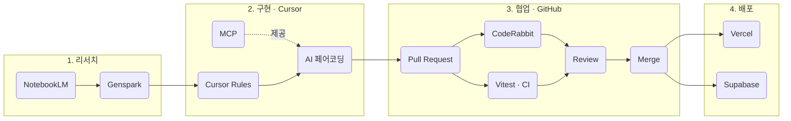
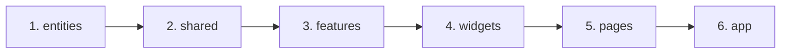
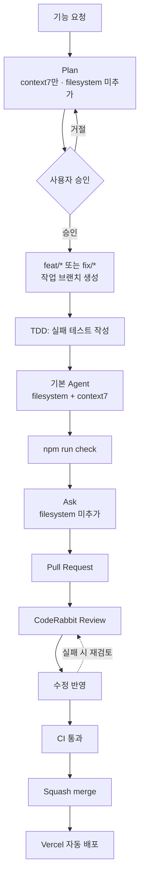
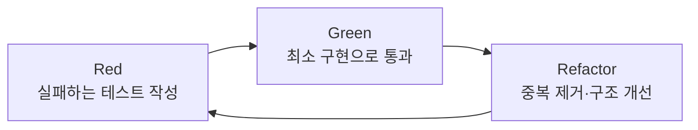
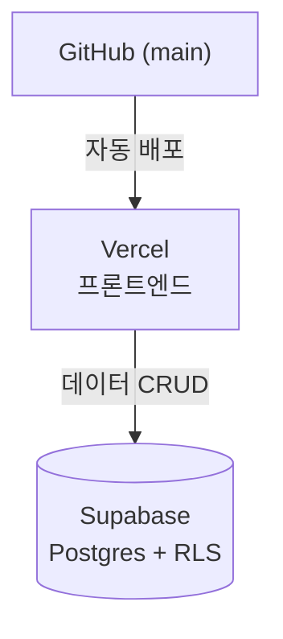

# Workflow

> 외환 창구 업무 도우미 (KB FX Helper)

## 문서 개요

이 문서는 이 프로젝트의 **AI 협업 Workflow**를 정의한다. 리서치(NotebookLM, Genspark)부터 구현(Cursor, MCP), 협업(GitHub, CodeRabbit), 검증(Vitest), 배포(Vercel, Supabase)까지 이어지는 전체 도구 체인을 다룬다. 이 문서는 `PRD.md`, `ARCHITECTURE.md`, `README.md`, `REPORT.md`에서 그대로 인용되는 것을 전제로 작성했다.

## 한눈에 보는 AI 협업 Workflow

| 단계 | 도구 | 역할 | 산출물 |
|---|---|---|---|
| 1. 리서치 | **NotebookLM** | 외환·환율 도메인 자료를 업로드해 학습·요약, PRD 작성 전 배경지식 확보 | 도메인 요약 노트 |
| 1. 리서치 | **Genspark** | 유사 서비스 조사, 문서 초안(PRD/README) 생성 보조 | PRD/README 초안 |
| 2. 구현 | **Cursor** | `.cursor/rules/*.mdc` 기반 AI 페어 프로그래밍으로 FSD 레이어별 코드 작성 | 소스 코드(entities~app) |
| 2. 구현 | **MCP** | 외부 문서·프로젝트 파일 컨텍스트를 Cursor에 연결 ([`MCP.md`](MCP.md)) | Cursor 내 실시간 컨텍스트 |
| 2. 구현 | **Plan / Agent / Ask** | 계획·구현·리뷰 단계별 작업 방식 분리 ([`CUSTOM_MODES.md`](CUSTOM_MODES.md)) | 단계별 AI 행동 제약 |
| 3. 협업 | **GitHub** | feat 브랜치/PR로 변경 공유, Actions로 CI 실행 | Pull Request |
| 3. 협업 | **CodeRabbit** | PR에 대한 AI 자동 코드 리뷰(FSD 위반, 규칙 위반 탐지) | 리뷰 코멘트 |
| 3. 협업 | **Vitest** | TDD 기반 단위 테스트, CI에서 자동 실행 | 테스트 리포트 |
| 4. 배포 | **Vercel** | main 병합 시 프론트엔드 자동 배포 | 배포된 웹 앱 |
| 4. 배포 | **Supabase** | 거래기록 저장용 클라우드 DB(Postgres) + RLS | 클라우드 데이터 저장소 |

## 목차

1. [프로젝트 시작](#1-프로젝트-시작)
2. [개발 준비](#2-개발-준비)
3. [구현 순서](#3-구현-순서)
4. [AI 협업 Workflow](#4-ai-협업-workflow)
5. [Git 전략](#5-git-전략)
6. [테스트 전략](#6-테스트-전략)
7. [배포](#7-배포)
8. [완료 기준](#8-완료-기준)

---

## 1. 프로젝트 시작

- **요구사항 분석(PRD)**: NotebookLM으로 외환 창구 업무 도메인 자료를 학습·요약하고, Genspark로 유사 서비스와 요구사항 초안을 조사한 뒤 `PRD.md`로 정리한다.
- **Architecture 설계**: PRD를 기반으로 FSD 레이어, 의존 규칙, 도메인 설계를 `ARCHITECTURE.md`로 문서화한다.
- **Cursor Rules 작성**: PRD·ARCHITECTURE에서 도출한 규칙을 `.cursor/rules/*.mdc`로 코드화하여, 이후 모든 구현 단계에서 Cursor가 자동으로 규칙을 강제하도록 한다.

## 2. 개발 준비

| 항목 | 내용 |
|---|---|
| React | UI 라이브러리. 함수형 컴포넌트 + Hooks만 사용 |
| Tailwind CSS v4 | 유틸리티 클래스 기반 스타일링, 별도 CSS 파일 최소화 |
| FSD | `entities/shared/features/widgets/pages/app` 레이어 구조, 폴더가 곧 의존 규칙 |
| Git | `main` 기준 브랜치 + `feat/*`·`fix/*` 작업 브랜치 + PR 기반 병합 |
| MCP | [`.cursor/mcp.json`](../.cursor/mcp.json) — `filesystem`(프로젝트 파일), `context7`(라이브러리 문서). 초기 설정은 [`MCP.md`](MCP.md) 참고 |
| 작업 방식 | Cursor 내장 **Plan**(계획) · **기본 Agent**(구현) · **Ask**(리뷰) + MCP Servers 대화별 추가. 설정은 [`CUSTOM_MODES.md`](CUSTOM_MODES.md) 참고 |

> 위 항목 중 React/Tailwind/FSD/Git은 `.cursor/rules/00-architecture.mdc`, `20-ui.mdc`에 규칙으로 등록되어 있다. MCP는 개발 중 외부·프로젝트 컨텍스트를 연결하고, Plan / 기본 Agent / Ask 조합으로 단계별 Agent 권한(특히 filesystem MCP on/off)을 분리한다.

## 3. 구현 순서

> 참고: 이 순서는 **구현(작성) 순서**이며, `ARCHITECTURE.md` 3장의 **의존 방향**(`app → pages → widgets → features → entities → shared`, 상위가 하위를 사용)과는 반대다. 도메인 모델(entities)을 먼저 확정해야 이후 레이어의 계약이 안정되기 때문에, 구현은 아래에서 시작해 위로 쌓아 올린다.

| 순서 | 레이어 | 구현 내용 | 이유 |
|---|---|---|---|
| 1 | entities | 도메인 모델(Currency, Rate, Transaction)과 순수 계산 규칙 | 핵심 개념을 가장 먼저 확정해야 이후 레이어의 계약이 안정된다 |
| 2 | shared | entities가 실제로 필요로 하는 공용 유틸(반올림, 포맷)·API/lib | 필요한 만큼만 최소로 만들어 과잉 설계(speculative generality)를 방지한다 |
| 3 | features | `calculate-exchange`, `add-transaction` 등 유스케이스 | entities+shared가 준비된 뒤 비즈니스 로직을 조립한다 |
| 4 | widgets | `exchange-panel`, `transaction-history-panel` 등 UI 블록 | feature/entity 조합이 끝난 뒤 화면 블록을 구성한다 |
| 5 | pages | `dashboard` 등 라우트 단위 화면 | widgets가 완성되어야 페이지에 배치할 수 있다 |
| 6 | app | 진입점, 전역 Provider, 라우팅 설정 | 모든 레이어가 준비된 뒤 앱을 최종 조립·부팅한다 |

## 4. AI 협업 Workflow

| 단계 | 도구/명령 | 설명 |
|---|---|---|
| 계획 | **Plan** + 사람 | FSD 영향 분석, 변경 파일·구현 순서·테스트 계획을 문서화한다. **코드·설정 변경 금지**. context7만 MCP Servers에 추가 |
| 승인 | 사람 | 계획을 검토하고 구현 범위를 확정한다 |
| 작업 브랜치 | Git | 승인 직후 `feat/*` 또는 `fix/*` 브랜치를 생성한다. **새 기능·문서 기능 추가**는 `feat/*`, **버그·운영 장애 수정**은 `fix/*`. `main` 직접 커밋 금지 |
| Test | Vitest(TDD) | 작업 브랜치에서 새 도메인/유스케이스의 실패하는 테스트를 먼저 작성한다 |
| 구현 | **기본 Agent** + Cursor Rules + MCP | 승인된 계획 범위 내에서 `.cursor/rules/*.mdc` 기반으로 FSD 레이어별 코드를 작성한다. filesystem·context7 MCP 사용 |
| `npm run check` | oxlint, `scripts/check-architecture.mjs`, `tsc -b`, Vitest, Vite build | 로컬에서 커밋 전 lint → FSD 아키텍처 검사 → 타입체크 → 테스트 → 빌드를 한 번에 실행한다 |
| 리뷰 | **Ask** | FSD·보안·테스트 관점에서 이슈를 식별한다. **코드 수정 없이** 검토 결과만 작성 |
| Pull Request | GitHub | 변경 목적과 8장 DoD 체크리스트를 PR 본문에 기재한다 |
| CodeRabbit Review | CodeRabbit(`.coderabbit.yaml`) | PR 생성 즉시 AI가 FSD 규칙 위반, public API 우회, 보안/CSV/Supabase 규칙 등을 1차 리뷰한다 |
| 수정 반영 | **기본 Agent** | 리뷰 코멘트를 반영하고, 필요하면 CodeRabbit이 다시 리뷰한다(request changes workflow) |
| CI 통과 | GitHub Actions(`.github/workflows/ci.yml`) | PR과 `main` push마다 `npm run check`를 실행해 통과해야 병합할 수 있다 |
| Merge | GitHub | 리뷰 승인 + CI 통과 후 `main`에 Squash merge한다 |
| Vercel 자동 배포 | Vercel | `main` 병합 시 자동으로 프로덕션에 배포된다 |

### MCP 사용 시점

| 작업 단계 | Cursor 방식 | filesystem MCP | context7 MCP | 용도 |
|---|---|---|---|---|
| 계획 | Plan | 대화에 미추가 | 추가 | 라이브러리·API 문서 조회로 계획 정확도 향상 |
| 구현 | 기본 Agent | 추가 | 추가 | 프로젝트 파일 읽기·쓰기 + 문서 조회 |
| 리뷰 | Ask | 대화에 미추가 | 필요 시 추가 | 근거 확인용 문서 조회만 |

Plan / 기본 Agent / Ask 선택 절차·MCP 사용 정책·증빙 캡처는 [`CUSTOM_MODES.md`](CUSTOM_MODES.md)를, MCP 서버 설정·연결 확인은 [`MCP.md`](MCP.md)를 참고한다.

전체 도구 체인(NotebookLM~Supabase/Vercel)에서의 위치는 상단 [한눈에 보는 AI 협업 Workflow](#한눈에-보는-ai-협업-workflow) 표를 참고한다.

## 5. Git 전략

계획 승인 **직후** 작업 브랜치를 생성한 뒤, TDD·구현·리뷰·PR 순으로 진행한다. `main`에서 직접 커밋하지 않는다.

| 브랜치 접두사 | 사용 시점 |
|---|---|
| `feat/*` | 새 기능, 문서 기능 추가 |
| `fix/*` | 버그 수정, 운영 장애 수정 |

| 단계 | 설명 | 규칙 |
|---|---|---|
| 1. 작업 브랜치 | 승인 직후 `feat/*` 또는 `fix/*` 브랜치 생성 | `main` 직접 커밋 금지 |
| 2. TDD·구현·리뷰 | 작업 브랜치에서 테스트·코드·Ask 리뷰 수행 | §4 AI 협업 Workflow 순서 준수 |
| 3. Pull Request | 작업 완료 후 PR 생성 | 변경 목적과 8장 DoD 체크리스트를 PR 본문에 기재 |
| 4. Review | CodeRabbit(AI) + 팀원 리뷰 | FSD 위반, 규칙 위반, 테스트 누락 여부 확인 |
| 5. Merge | 승인 + CI(Vitest/Build) 통과 후 병합 | Squash merge, 병합 후 브랜치 삭제 |

## 6. 테스트 전략

| 테스트 종류 | 목적 | 도구 | 실행 시점 |
|---|---|---|---|
| TDD | 구현 전 실패하는 테스트로 요구사항을 명세 | Vitest | 새 도메인/계산 로직 작성 전 |
| 단위 테스트 | 순수 함수(계산, 검증)와 경계값 검증 | Vitest | 로컬 개발 중, PR 생성 전 |
| Regression Test | 버그 재현 테스트 추가, 기존 테스트 유지 | Vitest | 버그 수정 시, CI 전체 실행 |
| 아키텍처 검사 | FSD 레이어/슬라이스/public API 위반 자동 검출 | `scripts/check-architecture.mjs`(`npm run arch:check`) | 커밋 전 로컬, CI |
| Build Test | 타입/빌드 오류 확인 | `tsc -b && vite build` | PR 생성 시, CI |

> `npm run check` 한 번으로 `lint → arch:check → typecheck → test:run → build`를 순서대로 실행할 수 있다(로컬/CI 공용, `.github/workflows/ci.yml`이 동일 명령을 사용한다).

## 7. 배포

| 대상 | 설정 항목 | 값/내용 | 트리거 |
|---|---|---|---|
| Vercel | 배포 대상 | 프론트엔드(React+Vite 빌드 결과물) | `main` 병합 시 자동 배포, PR은 Preview 배포 |
| Vercel | 환경변수 | API Key 등 민감 정보는 Vercel Function 환경변수로 격리 | 배포 시 주입 |
| Supabase | 배포 대상 | 거래기록 테이블(Postgres) | 스키마 마이그레이션 시 |
| Supabase | 보안 | RLS(Row Level Security)로 접근 제한 | 테이블 생성 시 설정 |

## 8. 완료 기준

**Definition of Done**

| 구분 | 조건 | 확인 |
|---|---|---|
| 기능 | PRD의 필수 기능이 모두 동작 | [ ] |
| 아키텍처 | FSD 레이어/의존 규칙 위반 없음(CodeRabbit·리뷰로 확인) | [ ] |
| 테스트 | 신규/변경 로직에 대한 Vitest 테스트 작성 및 통과 | [ ] |
| 회귀 | 기존 테스트 전체 통과(회귀 없음) | [ ] |
| 빌드 | `tsc -b && vite build` 오류 없이 성공 | [ ] |
| 리뷰 | CodeRabbit 코멘트 반영 + 팀원 승인(Approve) | [ ] |
| 배포 | Vercel Preview에서 정상 동작 확인 | [ ] |
| 문서 | 필요 시 PRD/ARCHITECTURE/README 갱신 | [ ] |
